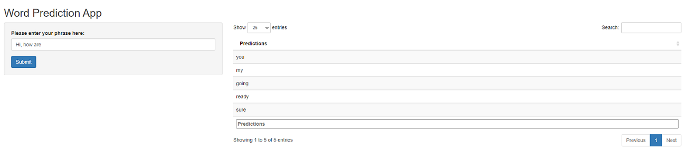

## Introduction

This is the final presentation to present the Word Prediction App created for the Capstone Project.

The Shiny Word Prediction application can be found here:
https://kaushik-sivasankaran.shinyapps.io/CapstoneProject/

**!!!Due to the size of the model, the application takes around 2 minutes to load. Thanks for your patience!!! **

The Shiny app source code is available at 
https://github.com/kaushiknyn/CapstoneProject

This slide deck will cover the following topics

- Data cleansing
- Algorithm
- The Application
- Look and feel

## Data Cleansing

- The first step of the process was to import the blog, news and twitter data, combine and sample them in order to acquire data of reasonable to size to create training and test datasets
- The next step was to cleanse this sampled data. In particular, profane words, alpha numeric characters, numbers, white spaces, etc., were removed
- Next, this cleansed data was then split into a train and test dataset and saved

## Algorithm 

- For this project, the *sbo* package was used to model and predict the next word using n-gram models (https://cran.r-project.org/web/packages/sbo/sbo.pdf)
- This is based on the simple back off prediction model (https://en.wikipedia.org/wiki/Katz%27s_back-off_model)
- The *sbo_predtable* function from the package allows the user to take in the training dataset, the number of N-grams to use for the (*5-grams were created for this prediction model*)
- The function also does a bit of preprocessing to further clean the data and also identify *End of Sentence (EOS)* patterns
- Based on the input, the model will provide the 5 highest probable next-word predictions
- Finally, the *sbo_predictor* function is used to build the model, which is stored in the *Predictor* object to be sourced in the shiny app server code 

## The Application

The Shiny Application comprises of a sidebar panel and a main panel

- The sidebar panel consists of an input text box with a default input of "Hi, how are". The user can provide their own input and click on the submit button
- The main panel comprises of an output table that provides the top 5 next-word predictions based on the user's input

## Look and Feel

This is how the interface will look:

